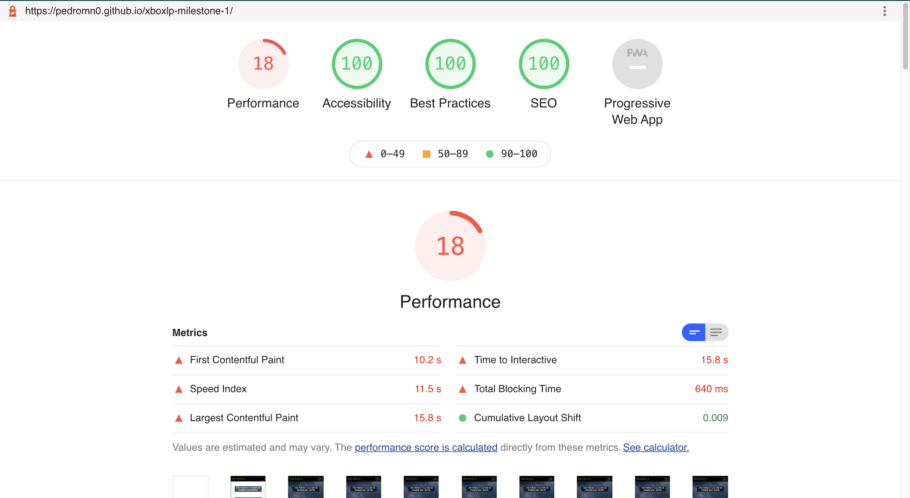

# Xbox Series X Landing Page

## Introduction

The idea of this project is to practice the knowledge learned so far about the first modules of the Code Institue software developement course. 

This project was developed as a requirement of the course and it is classified as the first milestone project with the subject defined as User Centric Frontend Development.  

The project itself consists of a Landing Page for the Xbox Series X, Microsoft's new video game console, with a focus on concentrating the main features of the console, but more than that sharing the message about the ecosystem around the console for whoever will be interested in buy the console.
 
## UX

The UX was idealized to connect the visual of the console, some elements of the brand but at same point feel transparency and straightforward about the key advantages and main capabilities of the ecosystem.

To help understand which elements would be interesting use to build the website some aspects regarding the strategy about the brand and console were considered as for example:
* Why are we special?
* Why would a user want this?
* Who else is doing this?
* What are the pros of what they're doing, and what are the cons?

After analyze the competitors (Nintendo and Playstation) was possible to sumarising what makes the Xbox different from those with the topics below:

- Xbox Series X is the most advanced console created in terms of processing power. 
- The Xbox deliveries an affordable game subscription which allows you to install up to 200 and this library receive contstant updates every month with new games.
- Xbox has the best backwards compatibility system to play old games with exclusive features.
- It is the only platform that allows you to play the same game in your console,PC or mobile utilising the same save. 

Embeded with those ideas the next step was create the user stories.

### External user’s goal:

Understand what is the value proposition of buying an Xbox series X. 
What games will be possible to play in this machine.
How well the games is going to run and in terms of graphic and performance.
The price and link to buy if needed and images and videos. 

### Site owner's goal:

Deliver a message stating the advantages of being a player on the Xbox platform. Draw the attention of current users on older Xbox consoles, non gamers and users of another platforms as Nintendo or Playstation.
The main ideia is convert them into consumers of the new Xbox product and services.

### Wireframe

In result of the analizis of the elements of the brand, product and competitors the wireframes were design with the ideia on minde to achive the main key differentials dividing the land page in three sections and one carousel to stand out the main message.

[Link to access individually the wireframes](https://github.com/pedromn0/xboxlp-milestone-1/tree/master/assets/wireframe)

Use this section to provide insight into your UX process, focusing on who this website is for, what it is that they want to achieve and how your project is the best way to help them achieve these things.

In particular, as part of this section we recommend that you provide a list of User Stories, with the following general structure:
- As a user type, I want to perform an action, so that I can achieve a goal.

This section is also where you would share links to any wireframes, mockups, diagrams etc. that you created as part of the design process. These files should themselves either be included as a pdf file in the project itself (in an separate directory), or just hosted elsewhere online and can be in any format that is viewable inside the browser.

## Features

The project was conceptualised to be straightforward utilising the main differentials of product to communicate the message across 4 main section as is possible to understand below:
 
1. Navbar;

2. Sliding carousel showcasing the main sections;
    
3. Section with main tech features;

4. Section dedicated to advertise Gamepass subscription and main games available to play;

5. Section to explain backwards compatibility system;

6. Footer.
    
### Existing Features

- The **Navbar** utilized came from bootstrap and was heavily eddited in the visual to match the visual identity of the project. In this feature is possibleto find the links for the main section. 
    - After hovering the mouse over each links, their apparence changes it for a combination of "Press (X, Y, B, or A)" to match the color scheme of the respective section to be selected and at same time combine the visual aspects buttons on a Xbox controller.

- The **Sliding Carousel** has the approach to stand out the main ideas with key images which works as link leading the users to a better understanding about what the user what to know more.
    - First image to draw attention to a button with a link to buy the console
    - 3 images works as big clickcalbe links to led to each section.

 - The **Tech Features Section** was developed to reassure the powerful capabilities of the console itself bringing clarity about what is possible to expect of the technologic point of view.
    - Background image of the console to stand out visually this section with a ghost column in the middle to always keep the console visible even in different screens sizes less in mobiles ones.
    - The color blue was choose to identify this section. 
    - Title utilising the same visual identity of the overlay-box to spread the main message of the section.
    - The message is organised in topics insie a main visual style common to all sections of the project the **overlay-box** which in this case match the blue of this section.

 - In **Games Section** is where relays the opportuny for Xbox showcase the platform as something more than just exclusive games or a single piece of hardware. This section were developed to explain for the future user what they advantages to be Xbox user’s and what are the different ways to be one. The best way to materialise assertively were throughout videos and brief description of them.
    - The color yellow was choose to identify this section. 
    - Title utilising the same visual identity of the overlay-box to spread the main message of the section.
    - Two responsible videos one in each part of this section wrapped by overlay-box in the color yellow.
    - Two text-boxes yellow wrapping the brief description of each video.
    - After both videos an small background image covered in shades of the same bakground color of the section to pass continuity and over it a link to Xbox wire blog where it is explaining the aquisition of Bethesda studios.

 - The **Backwards Compatibility** is the main unique approach of the brand and for this reason was choose to pass the idea of continuity that every user have accros different generations but keeping what the already have as a consumers of the brand and even better keep being able to playing games from previous genrations but in a better and unique way. In this section the tech capabilities were explored.
    - The color red was choose to identify this section. 
    - Title utilising the same visual identity of the overlay-box to spread the main message of the section.
    - Two illustrative images to represent each part of this section.
    - Two text-boxes wrapped on **overlay-box**  in the color red with message about Backwards compatibility system.

- **Footer** with social links and a link to website home.

### Features Left to Implement

The gallery was not possible to implement due to lack of time.
- Gallery in grid format to ilustrate some images of the new console.

## Technologies Used

All the Technologies utilised to built this landing page can be found bellow with the respective links.

### Languages
- [HTML](https://en.wikipedia.org/wiki/HTML) to build the whole structure of the landing page.
- [CSS](https://en.wikipedia.org/wiki/CSS) to style all the webiste.

### Frameworks and others

- [Gitpod](https://www.gitpod.io/) as the code editor.
- [Bootstrap 5.0](https://getbootstrap.com/docs/5.0/getting-started/introduction/) to buil carousel, navbar and use the grid system to better position all elements of the landing page.
- [Google Fonts](https://fonts.google.com/) for both fonts utilised in the project.
- [Font Awesome](https://fontawesome.com/) for the all icons.
- [Git](https://git-scm.com/) was used as tool to control the version of the project.
- [Git Hub](https://github.com/) to store the project with versionament control
- [Github pages](https://pages.github.com/) to deploy the live project.
- [Balsamiq](https://balsamiq.com/) to wireframe the ideia of the website.
- [Am I responsive](http://ami.responsivedesign.is/#) to help visualize the webiste in different screens sizes and get a print of it.
- [Sketch](https://www.sketch.com/) helped to create images or even resize them.

## Testing

The tests utilised were Google Lighthouse, W3C Html and CSS validator.

All the possible erros founded by W3C validators were corrected less the one being part of bootstrap Frameworks.

The only erro in the HTML not corrected were those three:

- For the first error I utilised an h2 tag for the section, but that was not considered by the validator.
- The other two erros are regarding the youtube embeded videos link copied directly by youtube.

The CSS validators showed no error:

Google ligthouse results:

All images were replaced with smaller sizes in an attempt to improve performance, but it was not possible to replace them with the format indicated by google Lighthouse because they are not widely accepted by major browsers.

### Responsiveness

This project was developed to work in at least 3 different sizes Desktop, mobile and Tablet. For that reason the site has been tested on several possible devices, from 11 "or 13" inch Macs, variable Android phones available to me as well as to some friends and relatives.

## Deployment

For deploy this project I utilised some of the mentioned technologies above to facilated this process.

1. The first step were created a repository on GitHub with the name **xboxlp-milestone-1**
2. Installed the **Gitpod** extension for **Google Chrome**;
3. Linked **Gitpod** gaving **access** to my **GitHub profile** with my login and password;
4. After that all repositories started to showed the **Gitpod button** just next to the button Code.
5. Clicking in the **Gitpod button** you have access to the code editor linked with this repository.
6. After editing the code it was possibble utilising **Git command** (status, add, commit and push) in the **terminal** updated Github repository.
7. To deploy was necessary went to repository settings and scrolled down untill the options Github pages **check it out here!**
8. In the link it was necessary went to option **source** and selected the main branch
9. After that I clicked on the button **save**.
10. Finally after those steps the link of the webiste was ready to be utilised and the project is live.

In addition, if it is not obvious, you should also describe how to run your code locally.

## Credits

### Content
- The text for section Y was copied from the [Wikipedia article Z](https://en.wikipedia.org/wiki/Z)

### Media
- The photos used in this site were obtained from ...

### Acknowledgements

- I received inspiration for this project from X
