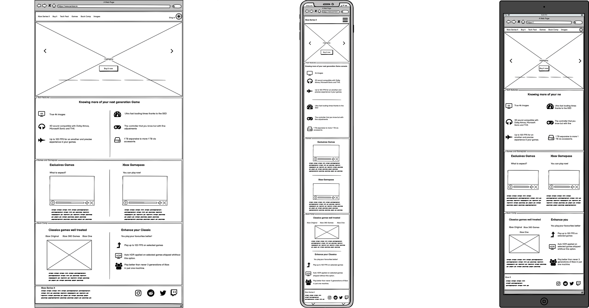

# Xbox Series X Landing Page

## Introduction

The idea of this project is to practice the knowledge learned so far about the first modules of the Code Institue software developement course. 

This project was developed as a requirement of the course and it is classified as the first milestone project with the subject defined as User Centric Frontend Development.  

The project itself consists of a Landing Page for the Xbox Series X, Microsoft's new video game console, with a focus on concentrating the main features of the console, but more than that sharing the message about the ecosystem around the console for whoever will be interested in buy the console.
 
## UX

The UX was idealized to connect the visual of the console, some elements of the brand but at same point feel transparency and straightforward about the key advantages and main capabilities of the ecosystem.

To help understand which elements would be interesting use to build the website some aspects regarding the strategy about the brand and console were considered as for example:
* Why are we special?
* Why would a user want this?
* Who else is doing this?
* What are the pros of what they're doing, and what are the cons?

After analyze the competitors (Nintendo and Playstation) was possible to sumarising what makes the Xbox different from those with the topics below:

- Xbox Series X is the most advanced console created in terms of processing power. 
- The Xbox deliveries an affordable game subscription which allows you to install up to 200 and this library receive contstant updates every month with new games.
- Xbox has the best backwards compatibility system to play old games with exclusive features.
- It is the only platform that allows you to play the same game in your console,PC or mobile utilising the same save. 

Embeded with those ideas the next step was create the user stories.

### External user’s goal:

Understand what is the value proposition of buying an Xbox series X. 
What games will be possible to play in this machine.
How well the games is going to run and in terms of graphic and performance.
The price and link to buy if needed and images and videos. 

### Site owner's goal:

Deliver a message stating the advantages of being a player on the Xbox platform. Draw the attention of current users on older Xbox consoles, non gamers and users of another platforms as Nintendo or Playstation.
The main ideia is convert them into consumers of the new Xbox product and services.

### Wireframe

In result of the analizis of the elements of the brand, product and competitors the wireframes were design with the ideia on minde to achive the main key differentials dividing the land page in three sections and one carousel to stand out the main message.

[Link to access individually the wireframes](https://github.com/pedromn0/xboxlp-milestone-1/tree/master/assets/wireframe)

Use this section to provide insight into your UX process, focusing on who this website is for, what it is that they want to achieve and how your project is the best way to help them achieve these things.

In particular, as part of this section we recommend that you provide a list of User Stories, with the following general structure:
- As a user type, I want to perform an action, so that I can achieve a goal.

This section is also where you would share links to any wireframes, mockups, diagrams etc. that you created as part of the design process. These files should themselves either be included as a pdf file in the project itself (in an separate directory), or just hosted elsewhere online and can be in any format that is viewable inside the browser.

## Features

The project was conceptualised to be straightforward utilising the main differentials of product to communicate the message across 4 main section as is possible to understand below:
 
1. Navbar;

2. Sliding carousel showcasing the main sections;
    
3. Section with main tech features;

4. Section dedicated to advertise Gamepass subscription and main games available to play;

5. Backwards compatibility system;

6. Footer.
    

In this section, you should go over the different parts of your project, and describe each in a sentence or so.

### Existing Features

- The **Sliding Carousel** has the approach to stand out the main ideas with key images which works as link leading the users to a better understanding about what the user what to know more.

 - The **Tech Features Section** was developed to just reassure the powerful capabilities of the console itself and clarity what is possible to expect in the technologic point of view.

 - In **Games Section** is where relays the opportuny for Xbox showcase the platform as something more than just exclusive games or a single piece of hardware. This section were developed to explain for the future user what they advantages to be Xbox user’s and what are the different ways to be one. The best way to materialise assertively were throughout videos and brief description of them.

 - The **Backwards Compatibility** is the main unique approach of the brand and for this reason was choose to pass the idea of continuity that every user have accros different generations but keeping what the already have as a consumers of the brand and even better keep being able to playing games from previous genrations but in a better and unique way. In this section the tech capabilities were explored.

For some/all of your features, you may choose to reference the specific project files that implement them, although this is entirely optional.

In addition, you may also use this section to discuss plans for additional features to be implemented in the future:

### Features Left to Implement
- Gallery on grid format to ilustrate some images of the new console.

## Technologies Used

In this section, you should mention all of the languages, frameworks, libraries, and any other tools that you have used to construct this project. For each, provide its name, a link to its official site and a short sentence of why it was used.

- [JQuery](https://jquery.com)
    - The project uses **JQuery** to simplify DOM manipulation.

## Testing

In this section, you need to convince the assessor that you have conducted enough testing to legitimately believe that the site works well. Essentially, in this part you will want to go over all of your user stories from the UX section and ensure that they all work as intended, with the project providing an easy and straightforward way for the users to achieve their goals.

Whenever it is feasible, prefer to automate your tests, and if you've done so, provide a brief explanation of your approach, link to the test file(s) and explain how to run them.

For any scenarios that have not been automated, test the user stories manually and provide as much detail as is relevant. A particularly useful form for describing your testing process is via scenarios, such as:

1. Contact form:
    1. Go to the "Contact Us" page
    2. Try to submit the empty form and verify that an error message about the required fields appears
    3. Try to submit the form with an invalid email address and verify that a relevant error message appears
    4. Try to submit the form with all inputs valid and verify that a success message appears.

In addition, you should mention in this section how your project looks and works on different browsers and screen sizes.

You should also mention in this section any interesting bugs or problems you discovered during your testing, even if you haven't addressed them yet.

If this section grows too long, you may want to split it off into a separate file and link to it from here.

## Deployment

This section should describe the process you went through to deploy the project to a hosting platform (e.g. GitHub Pages or Heroku).

In particular, you should provide all details of the differences between the deployed version and the development version, if any, including:
- Different values for environment variables (Heroku Config Vars)?
- Different configuration files?
- Separate git branch?

In addition, if it is not obvious, you should also describe how to run your code locally.

## Credits

### Content
- The text for section Y was copied from the [Wikipedia article Z](https://en.wikipedia.org/wiki/Z)

### Media
- The photos used in this site were obtained from ...

### Acknowledgements

- I received inspiration for this project from X
